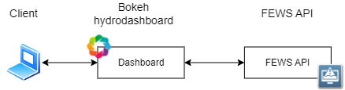
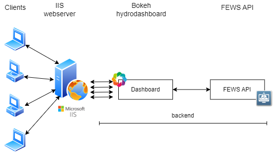
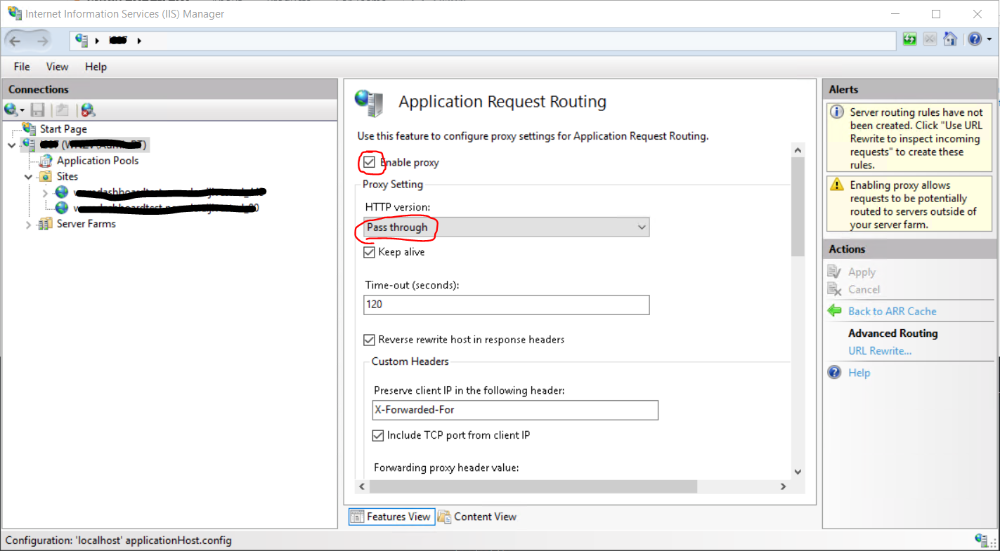
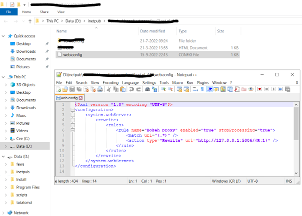

# Host your app

## Local or individual use
  
You can run your app locally on your computer as follows:  
In the directory: Open the folder where you installed your bokeh app.   
This folder contains the file: "serve_bokeh.bat". Run this file from the command line:  

```
serve_bokeh.bat  
```
The command prompt looks as follows:   
  

Open your web browser and copy the http adress to the browser. In this example: http://localhost:5003/bokeh  
If everything went right, the bokeh dashboard is shown in your browser.  


## Behind web service (Windows IIS)

Never expose the Bokeh HydroDashboard to the web directly.

Here you can find info on how to route your Bokeh HydroDashboard via Application Request Rerouting (ARR) in a Windows IIS web server.



### Installation
- Install the URL Rewrite package from the downloads section on the IIS website or Microsoft Web Platform Installer.
- Install the ARR (application request routing) 3.0 module from the downloads section on the IIS website or Microsoft Web Platform Installer. 
    
    <b>Note (!) web-socket routing is only possible from ARR 3.0.</b>

### Configuration of IIS
From the left pane, double-click on the main tree node with your server name on it, and from the modules, double-click on *Application Request Routing Cache*. In the right pane, choose *Enable proxy*, and set HTTP version to *Pass through*:



In the left pane, right-click on the website you created and select *Explore*. Windows explorer will open in *inetpub\your_website*. Open, or create a new *web.config* file at this location, so *inetpub\your_website\web.config*:



You can copy-paste this section:
```xml
<?xml version="1.0" encoding="UTF-8"?>
<configuration>
    <system.webServer>
        <rewrite>
            <rules>
                <rule name="Bokeh proxy" enabled="true" stopProcessing="true">
                    <match url="(.*)" />
                    <action type="Rewrite" url="http://127.0.0.1:5006/{R:1}" />
                </rule>
            </rules>
        </rewrite>
    </system.webServer>
</configuration>
```
### Allow web-socket routing
After restarting your IIS the backend-app should be re-routed to the root-adress of your website. If your app runs with content you're done. 

If not, you will only see an empty html page without content. In this case you have to enable the *WebSocket Protocol* in the *Add Roles and Features Wizard* of your server:


## Scale in production (NGiNX load balancer)
Bokeh HydroDashboards are scalable. Here we show how we can distribute Bokeh HydroDashboards over multiple proesses using a NGiNX load balancer. With a similar setup you can distribute Bokeh HydroDashboards over (even more) multiple backend servers.


For more info go to: http://nginx.org/en/docs/http/load_balancing.html  

### Installation

Download the stable version of nginx for windows, unzip it and put this in a chosen folder.

### Configuration of the load balancer
The folder conf contains the configuration file: nginx.conf. We need to change this file to enable load balancing. The example below shows the required configuration if we want to distribute the bokeh app traffic over 4 local hosts (5004,5005,5006 and 5007) via the least connection method. The server is listening on port 5003.  

    ```json
    events {}

    http {
        upstream bokeh {
        least_conn;
        server 127.0.0.1:5004;      # Bokeh Server 0
        server 127.0.0.1:5005;      # Bokeh Server 1
        server 127.0.0.1:5006;      # Bokeh Server 2
        server 127.0.0.1:5007;      # Bokeh Server 3
        }
        server{
        listen: 5003;
        location / {
            proxy_pass http://bokeh;
            proxy_set_header Upgrade $http_upgrade;
            proxy_set_header Connection "upgrade";
            proxy_http_version 1.1;
            proxy_set_header X-Forwarded-Proto $scheme;
            proxy_set_header X-Forwarded-For $proxy_add_x_forwarded_for;
            proxy_set_header Host $host:$server_port;
            proxy_buffering off;
            }
        }
    }
    ```
### Start Bokeh HydroDashboards
Your nginx configuration is now ready. Open the bokeh app folder, here you find the file: "serve_bokeh-loadbalancer.bat". If you view this file, you will see it   serves the bokeh application from Run this file from the 4 local hosts (5004,5005,5006 and 5007):  
```bat
start bokeh serve bokeh --port 5004 --allow-websocket-origin *   
start bokeh serve bokeh --port 5005 --allow-websocket-origin *   
start bokeh serve bokeh --port 5006 --allow-websocket-origin *   
start bokeh serve bokeh --port 5007 --allow-websocket-origin *   
```

 Run this file from the command-line as follows:

```console
serve_bokeh-loadbalancer.bat 
```

### Start the NGiNX load balancer
Start the nginx.exe (go to the folder where you installed nginx)  

If you open the listening port: 5003 (see nginx conf file) in your web browser (http://localhost:5003/bokeh), you have your local load balanced website. Because port: 5003 is redirected to the root-adress of your website (see the last section "(Behind web service (Windows IIS)"), your root website is also load balanced.

### Modify IIS configuration

Modify the web.config file part of the IIS configuration described in [Configuration of IIS](#markdown-header-configuration-of-iis), refering to the NGiNX load-balancer (and not a single bokeh application)

You can copy-paste this section:

```xml
<?xml version="1.0" encoding="UTF-8"?>
<configuration>
    <system.webServer>
        <rewrite>
            <rules>
                <rule name="Bokeh proxy" enabled="true" stopProcessing="true">
                    <match url="(.*)" />
                    <action type="Rewrite" url="http://127.0.0.1:5003/{R:1}"/>
                </rule>
            </rules>
        </rewrite>
    </system.webServer>
</configuration>
```