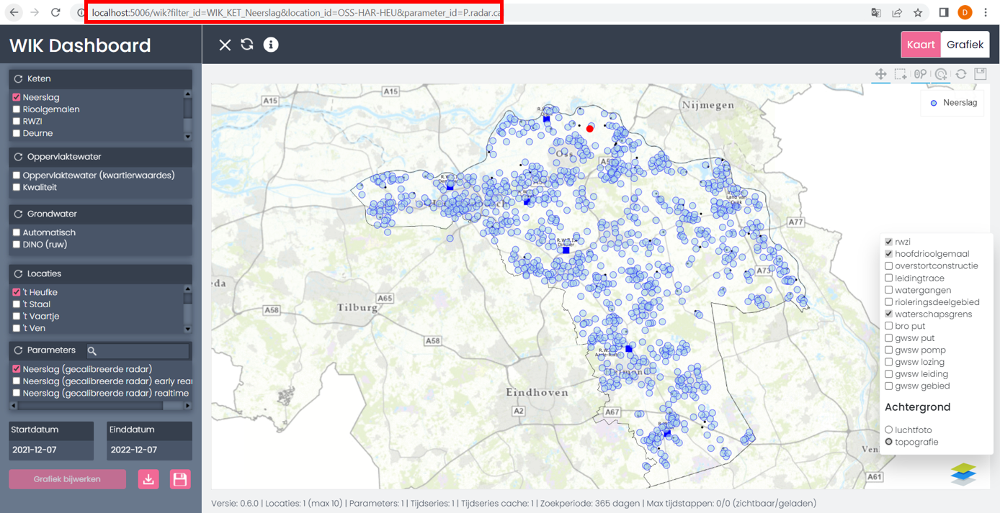

# Start with URL parameters

Example url: http://localhost:5006/wik?filter_id=WIK_KET_Neerslag&location_id=OSS-HAR-HEU&parameter_id=P.radar.cal

With:

- **filter_id**: one or more filter ids to select at startup. Optional; if not selected al filter_ids will be selected based on specified location_ids
- **location_id**: one or more location ids to select at startup
- **parameter_id**: one or more parameter ids to slect at startup
- **start_date**: start date in the form YYYY-MM-DD
- **end_date**: end_date in the form YYYY-MM-DD

When one or more location and paramter ids are selected, the data will be loaded for the specified period