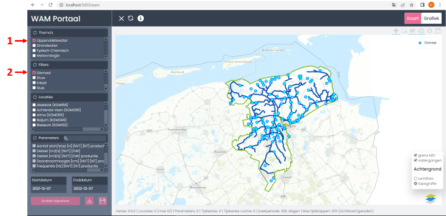
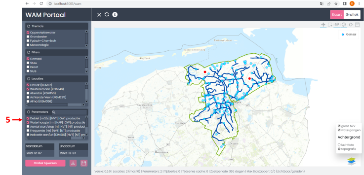
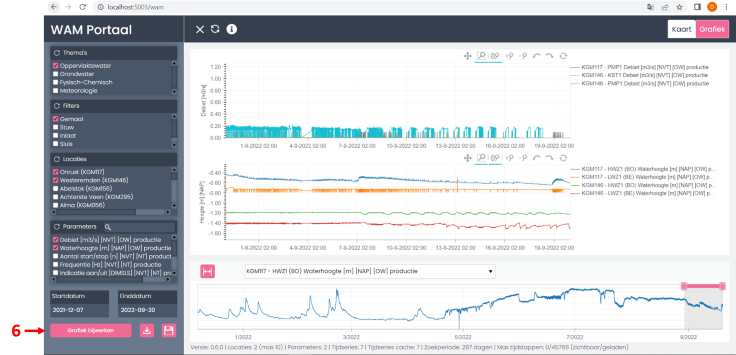
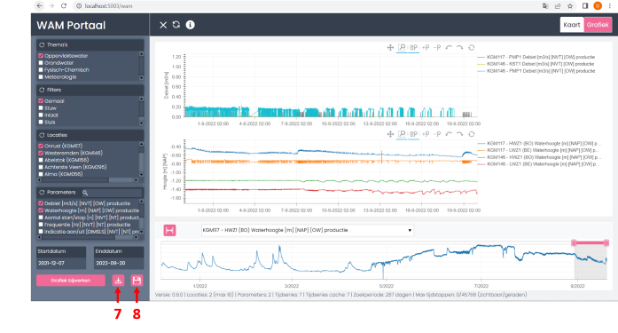
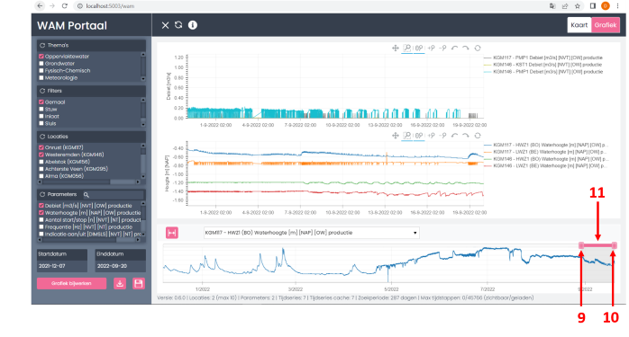
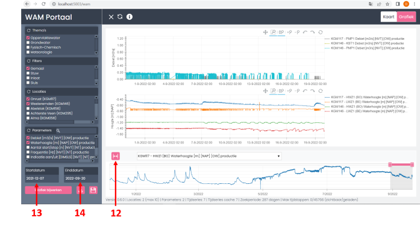

# Gebruikershandleiding

## Inladen tijdseries
### Selecteer filters


**Actie**:

1\. Selecteer een of meerdere thema's (wanneer de app in thema-view is geconfigureerd)

2\. Selecteer een of meerdere filters

**Resultaat**: Alle beschikbare locaties in de locaties-lijst en op de kaart. En alle beschikbare parameters in de lijst.

**Vervolgactie**: [Selecteer locaties](#selecteer-locaties) in de lijst of op de kaart

### Selecteer locaties


**Acties**:

3\. Selecteer locaties uit de lijst of,

4\. selecteer locaties op de kaart. Houd bij het selecteren van meerdere locaties op de kaart de CTRL knop op uw toetsenbord ingedrukt.

**Resultaten**:

- De geselecteerde locaties komen bovenaan in de lijst te staan.
- De lijst met parameters worden bijgewerkt en worden selecterbaar.

**Vervolgactie**: [Selecteer parameters](#selecteer-parameters) in de lijst

### Selecteer parameters




**Actie**:

5\. Selecteer een of meerdere parameters uit de lijst

**Resultaat**: De knop "Grafiek Bijwerken" wordt nu actief

**Vervolgactie**: De [grafiek bijwerken](#grafiek-bijwerken).

### Grafiek bijwerken

Actie:

6\. Druk op de knop "Grafiek bijwerken"

**Resultaten**:

- De data voor de locatie en parameter in de beschikbare periode wordt geladen
- De grafiek wordt getoond

**Vervolgacties**: U kunt nu de onder andere:

- [Downloaden van de grafieken](#grafieken-downloaden)
- [In- en uitzoomen binnen de zoekperiode](#zoomen-binnen-zoekperiode)
- [Aanpassen van de zoekperiode](#aanpassen-zoekperiode)

## Grafieken downloaden



**Acties**:

7\. Download de **zichtbare** data als Excel-bestand.

8\. Download de **zichtbare** data als plaatje.

Let op: standaard komen de bestanden in uw downloads-folder te staan. Het opgeven van een specifieke locatie en bestandsnaam kunt u regelen in uw browser-instellingen.

Voor Googl Chrome en Microsoft Edge:
```
instellingen -> downloads -> Voorafgaand aan een download vragen waar een bestand moet worden opgeslagen (toggle aan)
```
Voorafgaand aan elke download zal de browser nu vragen waar u met welke naam het bestand wilt opslaan.

## Zoomen binnen zoekperiode
Binnen de gezochte periode, zichbaar op onderstaande grafiek wordt ingezoomd in de bovenste grafieken. U kunt naar de juiste periode gaan met de slider tussen de grafieken:



**Acties**:

9\. Toon data verder terug in tijd

10\. Toon data verder in tijd (nooit verder dan nu!)

11\. Verplaats schuif de periode terug of verder in tijd

## Aanpassen zoekperiode
De gezochte periode kunt u ook aanpassen met de volgende mogelijkheden:



**Acties**:

12\. Toon de zoekperiode voor álle data beschikbaar voor de zoekgrafiek (=onderste grafiek)

13\. Kies een datum verder terug in de tijd

14\. Kies een datum verder in de tijd (nooit verder dan nu!)

Na het kiezen van optie 13 of optie 14 moet u wél eerst de [grafiek bijwerken](#grafiek-bijwerken) om nieuwe data in de grafiek te tonen.

